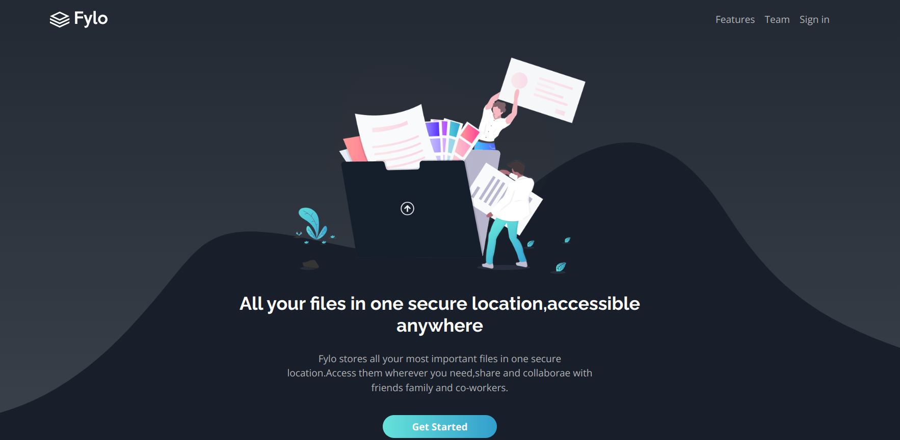

# Frontend Mentor - Fylo dark theme landing page solution

This is a solution to the [Fylo dark theme landing page challenge on Frontend Mentor](https://www.frontendmentor.io/challenges/fylo-dark-theme-landing-page-5ca5f2d21e82137ec91a50fd). Frontend Mentor challenges help you improve your coding skills by building realistic projects.

## Table of contents

- [Overview](#overview)
  - [The challenge](#the-challenge)
  - [Screenshot](#screenshot)
  - [Links](#links)
- [My process](#my-process)
  - [Built with](#built-with)
  - [What I learned](#what-i-learned)
  - [Continued development](#continued-development)
  - [Useful resources](#useful-resources)
- [Author](#author)
- [Acknowledgments](#acknowledgments)

## Overview

### The challenge

Users should be able to:

- View the optimal layout for the site depending on their device's screen size
- See hover states for all interactive elements on the page

### Screenshot

### Links

- Solution URL: [Source code](https://github.com/Rickyngechu/proj-11)
- Live Site URL: [Netlify live web](https://frontendmentour-11.netlify.app)

## My process

- First build the mobile version of the application applying the relevant image responsiveness then implement the desktop version.

### Built with

- Semantic HTML5 markup
- CSS custom properties
- Flexbox
- Responsive web design.
- Mobile-first workflow.
- Tailwind css.

### What I learned

- I has been a while since I said that I would be using tailwind css,however I have found it to be a useful tool indeed.

### Continued development

I will continue using tailwind css for bulding more responsive layouts.

### Useful resources

- [Tools](Jonas.io/resources) - This helped me for color and web testing tools. I really liked this pattern and will use it going forward.

## Author

- Website - [Erick Ngechu](https://rickyportf.netlify.app)
- Frontend Mentor - [@Rickyngechu](https://www.frontendmentor.io/profile/Rickyngechu)
- Twitter - [@Ricky_101com](https://twitter.com/@Ricky_101com)

## Acknowledgments

I would like to acknowlegde Jonas schmedtman for the great skills he has offered me in his javascript courses.Furthermore I would like to pass my gratitude towards Kevin powell a great css master who has sharpened my css skills and responsive web design in general.

I would like to acknowledge the developers of Tailwind css.
